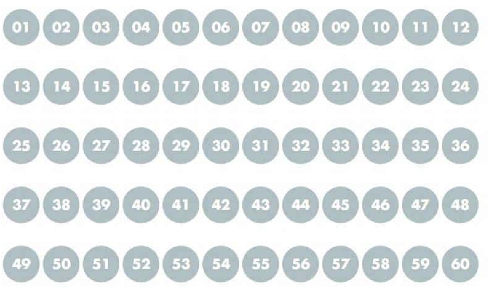
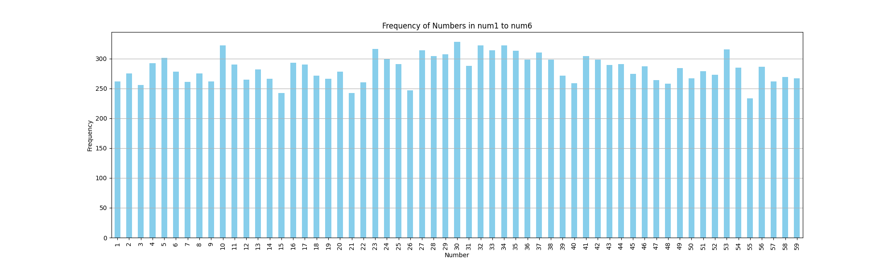

# Mega Model 🤖

> Try to predict the numbers of Mega-sena lottery.

## Goals

Predict the numbers of Mega-sena lottery from 1 to 60:



## Results

At this moment, there are less than 3000 contests available of Mega-sena,
to get a good prediction we would need millions of data from contests. But
overall, the model got a good performance, indicating that is possible to
predict if we have more data from contests:

```shell
Mean Absolute Error (MAE): 2.9519298899689512
Mean Squared Error (MSE): 14.102629179457253
Root Mean Squared Error (RMSE): 3.7553467455692093
Explained Variance Regression Score: 0.8029391703530994
R-squared (R²): 0.8018725514411926
```

### Predictions result


## Exploratory data analysis

> Numbers frequency



## Running

To run the model first create a new Python environment and activate it. I'm using [Anaconda](https://www.anaconda.com/) for setting the python version that pipenv should use to set up the environment. The command bellow will automatically setup the environment with conda and pipenv:

```shell
make env
```

Now install all the project dependencies:

```shell
make install-all
```

And run the model:

```shell
make model
```

> [!WARNING]
> Dont run `make model` without deleting `storage/mega-model.keras`, this will
> cause train/test data over fitting.

After running you model, it will be saved inside `storage/mega-model.keras`.
To just run your recent created model and predict a random value from our data set,
use the following script:

```shell
make predict 
```

The dataset was created with contests since 1966. There are in total 2735 contests
in our dataset. If the dataset needs to be updated, run the command bellow, it will automatically read the dataset to search if the latest contest 2736 is available:

```shell
make scrapper
```

After that you need to clean the dataset to add the `sum`, `mean` and `std` fields.
It will also separate the `numbers` fields into 6 others fields from `num1` to `num6`:

```shell
make cleaner
```

> [!WARNING]
> In case you have deleted the `storage/mega-model.keras`, remember that to get `make predict` working you need to run `make model` first to create it.

To run TensorBoard with the latest created version of the model within this
repository run:

```shell
make board
```
